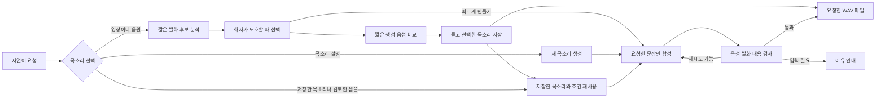

# Voice of Karina

**Codex나 Claude에 듣고 싶은 목소리와 문장을 말씀해 주세요.** YouTube 영상의 목소리를 참고하거나, 설명으로 새로운 목소리를 만들거나, 저장한 목소리를 다시 사용합니다. WAV 파일을 만들고, 원하시면 작업 완료 알림에도 연결합니다.

[English](README.md) · [모델 비교](docs/model-comparison.md)

<p align="center">
  
</p>

## 이렇게 요청해 주세요

**검토한 카리나 샘플 목소리 재사용하기**

> README의 “확인 요청” 샘플에 사용한 카리나 목소리로 “다음 작업도 준비됐어요.”를 만들어 주세요. 다음에도 같은 목소리를 쓸 수 있게 저장해 주세요.

해당 샘플에 사용한 정확한 참조 음성과 생성 조건이 프로젝트에 포함되어 있습니다.
영상을 다시 전달하지 않으셔도 됩니다.

**영상 속 목소리로 만들기**

> 이 영상의 카리나 목소리로 “작업이 끝났어요. 확인해 주세요.”를 만들어 주세요.
> https://www.youtube.com/watch?v=r96zEiIHVf4

**다른 사람의 목소리 준비하기**

> 첨부한 이채영 영상에서 혼자 또렷하게 말하는 구간들을 비교해서 “확인이 필요해요. 잠깐 봐 주세요.”를 만들어 주세요. 미리 듣기로 골라서 “채영 안내” 목소리로 저장하고 싶어요.

원하는 사람의 YouTube 링크를 하나 이상 붙여 주세요. 다른 화자도 같은 준비·비교·저장
흐름을 사용하며, 실제 음성의 품질은 각각 확인합니다.

**영상 없이 새 목소리 만들기**

> 따뜻하고 차분한 한국어 여성 목소리로 “잠시 쉬어 가셔도 괜찮아요.”를 만들어 주세요. 목소리는 “차분한 안내”라는 이름으로 저장해 주세요.

**저장한 목소리 재사용하기**

> “차분한 안내” 목소리로 “다음 작업도 준비됐어요.”도 만들어 주세요.

“음성을 만들고 싶어요”로 시작하셔도 됩니다. 스킬이 기존 사람의 목소리를 참고할지, 새로 만들지 대화로 정하고 빠진 정보만 여쭙습니다. 새로 참고할 사람은 YouTube 링크를 하나 이상, 새 목소리는 원하는 음색 설명을 전달해 주세요. 여러 사람이 등장하면 대상 화자를 확인한 뒤 짧은 생성 음성을 비교해 저장합니다. 한 구간으로 빠르게 만들어 달라고 요청하셔도 됩니다. 이미 주신 링크·문장·선택은 다시 묻지 않습니다.

## 한 번만 설치해 주세요

현재 로컬 음성 생성은 **macOS 14 이상인 Apple Silicon Mac**에서 지원하며 Python 3.12, [uv](https://docs.astral.sh/uv/getting-started/installation/), FFmpeg를 사용합니다. 모델은 처음 사용할 때 다운로드합니다. YouTube와 모델 다운로드에는 인터넷이 필요하며 참조 음성 분석과 합성은 로컬에서 실행됩니다.

```bash
brew install uv ffmpeg
git clone https://github.com/t1seo/voice-of-karina.git
cd voice-of-karina
uv sync --extra local
```

이 폴더를 **Codex 또는 Claude Code**에서 열고 위 예시처럼 요청해 주세요. 두 도구가 같은 `voice-of-karina` 스킬을 발견합니다. 직접 선택하려면 Codex에서는 `$voice-of-karina`, Claude Code에서는 `/voice-of-karina`를 사용하시면 됩니다.

다른 프로젝트에서도 사용하시려면 에이전트에 다음처럼 요청해 주세요.

> 이 저장소의 voice-of-karina 스킬을 Codex와 Claude Code 개인 스킬로 설치해 주세요. 기존 설치가 있으면 보존하고 현재 스킬 폴더를 링크해 주세요. 로컬 엔진은 이 저장소를 계속 사용해 주세요.

원본 스킬은 `.agents/skills/voice-of-karina`에 있습니다. 개인 설치 경로는 `~/.agents/skills/voice-of-karina`, `~/.claude/skills/voice-of-karina`입니다. 저장소 폴더는 유지해 주세요. 스킬은 링크의 실제 위치를 찾아 uv로 필요한 환경을 준비하므로 다른 프로젝트에서도 같은 엔진을 사용합니다.

이번 구현에는 Linux/CUDA, Intel Mac, CPU 전용 실행과 API 합성 백엔드가 없습니다. 대체 로컬 모델과 유료 API는 [모델 비교 문서](docs/model-comparison.md)에 정리했으며 자동 대체 경로로 사용하지 않습니다.

## 요청을 처리하는 흐름



재사용할 새 목소리는 보통 참조 두 개로 미리 듣기 네 개를 비교합니다. 비교 작업은
최대 12회로 제한하며 중단 후에도 이미 끝난 비교를 반복하지 않습니다. 모든 미리 듣기
문장의 자동 검사를 통과한 조건 중에서 직접 듣고 고르실 수 있습니다. 자연스러움이나
원하는 사람과의 유사성을 자동 검사만으로 판정하지 않습니다. 선택한 미리 듣기가 이미
요청하신 문장이라면 그 파일을 바로 전달합니다.

일반 메시지 생성에서는 작업 진행 상태와 문장별 결과를 저장합니다. 품질 검사 후 재시도는 기본적으로 **첫 생성을 포함해 문장당 총 2회**, 최대 3회입니다. 한 문장이 실패해도 정상 결과는 보존하며 중단한 작업은 기존 시도 횟수를 유지한 채 이어서 진행합니다.

자동 검사를 통과했어도 “시작에 잡음이 있으니 다시 만들어 주세요”처럼 피드백하실 수 있습니다. 스킬은 해당 결과의 거절 사유를 기록하고 같은 작업의 남은 횟수 안에서 다시 생성합니다. 거절한 파일이 작업 복구 중에 다시 선택되지 않으며 다른 정상 문장은 유지합니다.

저장한 목소리는 정확한 참조 음성·전사문·생성 조건을 함께 보관합니다. 비교해서 선택한
목소리에는 미리 듣기 결과와 선택 이유도 남깁니다. 다음 문장은 이 조건을 다시 불러와
만들기 때문에 다운로드와 참조 비교를 반복하지 않습니다. 새 문장은 별도로 검사하며,
목소리를 저장했다고 이후의 모든 음성이 검토된 것으로 처리하지 않습니다. 예전에 참조만
저장한 목소리도 계속 사용할 수 있으며, 검토한 생성 조건이 있는 것으로 간주하지 않습니다.

작업과 목소리는 기본적으로 저장소의 `.voice-of-karina/`에 보관합니다. 다른 폴더에서 스킬을 실행해도 같은 저장소를 사용합니다. `VOICE_OF_KARINA_HOME`으로 위치를 바꿀 수 있으며 이어서 실행하거나 목소리를 재사용할 때는 같은 경로를 유지해 주세요.

## 자연스러운 음성과 잡음 처리

기본은 **깨끗한 원본 발화를 고르는 것**입니다. 모든 영상에 음악 분리·잡음 제거·EQ·압축을 일괄 적용하지 않습니다. 이런 처리는 보존하려는 음색까지 바꿀 수 있습니다.

분석에서는 발화 비율, 음량, 클리핑, 주파수 특성을 측정하고 후보 음성과 주의점을 보여 줍니다. 이 값은 추정 지표이며 음악이나 화자를 확실하게 식별하는 기능은 아닙니다. 링크를 여러 개 주시면 후보가 늘어나며 서로 다른 녹음을 자동으로 섞지 않습니다.

한 사람이 짧고 완결된 문장을 또렷하게 말하는 구간이 좋습니다. 음악이 크거나 여러 사람이 겹쳐 말하면 다른 구간 또는 더 깨끗한 영상을 전달해 주세요. 원하는 사람이 말하는 타임스탬프가 있으면 선택에 도움이 됩니다.

신뢰할 수 있는 전사에 여러 발화가 있으면 실제 쉼 구간으로 둘러싸인 짧은 후보를 추가로 제안합니다. 잘라낸 후보는 다시 전사해 확인합니다. 후보는 최대 4개를 보여 드리며, 원래 후보를 최소 1개 남깁니다. 참조 음성은 원래 샘플레이트를 유지합니다. 기존에 저장한 목소리의 참조는 바꾸지 않으므로, 개선된 참조를 사용하시려면 새 후보를 선택해 별도 목소리로 저장해 주세요.

복제와 저장한 목소리 재사용에는 품질을 우선해 **Qwen3-TTS 1.7B Base (4-bit)**를 사용합니다. 이전 0.6B 모델보다 생성 시간이 늘어나는 점은 [실측 비교](docs/model-comparison.md)에 정리했습니다. 결과는 음성 신호, 강화된 문장 일치 기준, 요청한 끝말, 한국어 모음 끝부분의 급격한 끊김을 함께 검사하고 의심되는 결과는 정해진 횟수 안에서 다시 생성합니다. 토큰 한도에 도달한 생성은 거부하며 전사가 불가능하거나 불확실하면 미검증 상태로 안내합니다. 자동 검사는 발음·자연스러움·인물과의 유사성을 보장하지 않으므로 직접 들어 보시고 선택해 주세요. 저장한 목소리의 속도·감정 조절은 지원하지 않습니다.

끝말 잘림과 참조 발화 실험은 [음성 품질 개선 노트](docs/quality-improvement-notes.ko.md)에 정리했습니다. [목소리 재사용 연구](docs/reusable-voice-research.md)에는 참조 선정·평가 한계·로컬 대안을, [구현 검증 기록](docs/reusable-voice-validation.ko.md)에는 실제 재사용과 비교 경로를 확인한 결과를 남깁니다.

## 원하시면 완료 알림에 적용하세요

> 방금 만든 문장을 Codex와 Claude Code의 작업 완료 알림으로 적용해 주세요.

요청하신 경우에만 설치합니다. **Claude의 `Stop` 훅**, **Codex의 `agent-turn-complete` 알림**에 연결하며 권한 요청·인증 등 다른 이벤트는 연결하지 않습니다.

비교용 미리 듣기는 바로 재생하거나 내려받을 수 있습니다. 알림 적용을 요청하시면
선택한 목소리로 일반 생성 작업을 한 번 진행하고 결과를 확인한 뒤 설치합니다.
비교 작업의 파일을 직접 설치하는 기능은 아직 없습니다.

설정 변경 전 백업을 만들고 다른 Claude 훅을 유지하며 다른 Codex 알림 프로그램에도 이벤트를 전달합니다. 이 프로젝트의 옛 재생기를 연결한 정확한 경로는 명시적으로 새 알림을 설치할 때 교체해 중복 재생을 막습니다. 같은 음성을 다시 설치해도 중복으로 추가하지 않습니다. 각 도구의 설정 폴더에 전용 재생기와 WAV를 복사하므로 알림이 울릴 때 모델을 로드하거나 프로젝트 환경을 실행하지 않습니다. 적용 후 해당 에이전트를 재시작해 주세요.

## 카리나 샘플 듣기

새 엔진이 [카리나 인터뷰](https://www.youtube.com/watch?v=r96zEiIHVf4)의 발화를 참고해 생성한 한국어 샘플입니다. 카리나가 이 문장을 직접 말한 녹음이 아닌 합성 음성입니다. 각 영상의 재생 버튼을 눌러 주세요.

**작업 완료** · 작업이 끝났어요. 확인해 주세요.

https://github.com/user-attachments/assets/93c3f76f-097a-4e78-9cf8-0260fc86378f

**확인 요청** · 확인이 필요해요. 잠깐 봐 주세요.

로컬 통제 실험에서 선정하고 재검증한 샘플입니다. [참조 구간과 품질 기록](docs/quality-improvement-notes.ko.md#7-공개-샘플의-선택과-한계)을 함께 확인하실 수 있습니다.

https://github.com/user-attachments/assets/1c1be57f-a4df-4fc5-8141-d00014bcc526

**다음 작업 준비** · 다음 작업도 준비됐어요.

https://github.com/user-attachments/assets/d228e9b7-9f96-40b7-9f25-9fcb03751b47

**잠깐 쉬어 가기** · 오늘도 수고 많으셨어요. 잠깐 쉬었다가 다시 시작해 볼까요?

https://github.com/user-attachments/assets/db7d7fc2-3ee0-4682-a955-bea2725e0767

WAV 다운로드: [작업 완료](assets/samples/karina-done.wav), [확인 요청](assets/samples/karina-attention.wav), [다음 작업 준비](assets/samples/karina-ready.wav), [잠깐 쉬어 가기](assets/samples/karina-break.wav). 영상 없이 만든 [새 목소리](assets/samples/original-rest.wav)는 “잠시 쉬어 가셔도 괜찮아요.”라고 말합니다. [듣기 페이지](docs/samples.html)를 로컬에서 열면 이 다섯 음성과 아래 이채영 샘플 일곱 개를 재생할 수 있습니다. 입력·모델·품질 검사 기록은 [샘플 출처](assets/samples/provenance.json)에 있습니다.

## 이채영 샘플 듣기

**재생 가능한 샘플은 7개입니다.** A·B·C 후보별 두 문장씩 6개와 새 문장 1개입니다. [프로미스나인 이채영 인터뷰](https://www.youtube.com/watch?v=opvsj3J5ccs)를 참고해 생성한 합성 음성이며, 이채영이 직접 이 문장을 말한 녹음이 아닙니다. 모두 자동 검사를 통과했고, 최종 청취 선택은 아직 하지 않았습니다. 각 후보를 펼쳐 두 음성을 비교해 주세요.

<details open>
<summary>후보 A · 미리 듣기 2개</summary>

**확인 요청** · 확인이 필요해요. 잠깐 봐 주세요.

https://github.com/user-attachments/assets/0293a99b-a977-46bc-8922-cd1db9d1f4ad

**작업 완료** · 작업이 끝났어요. 확인해 주세요.

https://github.com/user-attachments/assets/137ca7ad-386f-4a63-82bd-12a00ec3001e

WAV 다운로드: [확인 요청](assets/evaluation/reusable-voices/chaeyoung/trial-2dccd0e42fe196497aaf2c3e-attention.wav) · [작업 완료](assets/evaluation/reusable-voices/chaeyoung/trial-2fd19d49ef09b44af875ca9a-done.wav)

</details>

<details>
<summary>후보 B · 미리 듣기 2개</summary>

**확인 요청** · 확인이 필요해요. 잠깐 봐 주세요.

https://github.com/user-attachments/assets/0887285c-be4e-4a09-97bc-faf374f27c17

**작업 완료** · 작업이 끝났어요. 확인해 주세요.

https://github.com/user-attachments/assets/cfe86949-cd0f-408d-bf94-bc3b2f74a8c8

WAV 다운로드: [확인 요청](assets/evaluation/reusable-voices/chaeyoung/trial-4a3d04c3f19ef098a2cee5de-attention.wav) · [작업 완료](assets/evaluation/reusable-voices/chaeyoung/trial-68b0a9e08909140ae280ee17-done.wav)

</details>

<details>
<summary>후보 C · 미리 듣기 2개</summary>

**확인 요청** · 확인이 필요해요. 잠깐 봐 주세요.

https://github.com/user-attachments/assets/befe8618-aa1d-4bba-94c0-ee03ec601128

**작업 완료** · 작업이 끝났어요. 확인해 주세요.

https://github.com/user-attachments/assets/5b9171be-65c5-48da-a14c-d4d2ff690163

WAV 다운로드: [확인 요청](assets/evaluation/reusable-voices/chaeyoung/trial-26da080d2d2264c20d1ec987-attention.wav) · [작업 완료](assets/evaluation/reusable-voices/chaeyoung/trial-31ab28107e439424523047fb-done.wav)

</details>

**새 문장** · 잠시 쉬었다가 다음 작업을 시작해 볼까요?

긴 참조 구간을 재사용해 두 번째 시도에서 통과한 추가 문장입니다. 위 후보들을 비교·선택하는 데 사용한 문장은 아닙니다.

https://github.com/user-attachments/assets/d0673b28-8bd7-4646-bd40-326d43c90c6e

[WAV 다운로드](assets/evaluation/reusable-voices/heldout/chaeyoung-long.wav) · [샘플 출처와 생성 조건](assets/samples/chaeyoung-provenance.json)

저장소에 보관한 이채영 검증 WAV는 **총 10개**로, 비교용 8개와 새 문장의 최종 결과 2개입니다. 위 플레이어는 후보별 두 문장씩 6개와 통과한 새 문장 1개입니다. 나머지 통과 샘플 1개와 실패 결과 2개도 [전체 검증 듣기 페이지](docs/reusable-voice-evaluation.html)를 로컬에서 열어 확인하실 수 있습니다. 자세한 결과는 [검증 기록](docs/reusable-voice-validation.ko.md)에 있습니다.

## 개발

사용자 인터페이스는 대화 스킬입니다. 내부 JSON 실행 계약과 예시는 [엔진 참조 문서](.agents/skills/voice-of-karina/references/engine.md)에 있습니다.

```bash
uv run pytest
uv run ruff check .
uv run basedpyright
```

## 후원

[](https://www.buymeacoffee.com/taewonseo)

## 라이선스

MIT. 생성 결과는 합성 음성이며 참조 인물의 실제 녹음이나 프로젝트에 대한 보증을 의미하지 않습니다.
