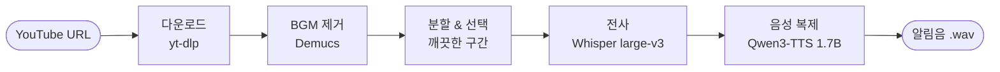

# Karina Voice Notification Generator

**AI 음성 복제 도구** — YouTube 영상의 목소리로 Claude Code 맞춤 알림음을 생성합니다. Qwen3-TTS, Whisper, Demucs 기반.

<p align="center">
  
  
  
  
  
  <a href="README.md"></a>
</p>

<p align="center">
  
</p>

## 📖 이게 뭔가요?

Claude Code는 당신의 주의가 필요할 때 알림음을 재생합니다 — 권한 요청, 작업 완료 등.
이 도구는 그 **알림음을 원하는 사람의 목소리로 바꿔줍니다.** YouTube 클립 하나로 목소리를 복제하죠.

YouTube URL(인터뷰, 방송, 팟캐스트)을 넣고 깨끗한 몇 초의 발화를 고르면, 그 사람 목소리로
한국어·영어 알림 문장 세트를 생성합니다 — 명령어 하나로 Claude Code에 바로 연결할 수 있어요.
모든 처리는 **로컬**(Apple Silicon 또는 NVIDIA GPU)에서 이뤄지며, 음성은 컴퓨터 밖으로 나가지 않습니다.

먼저 들어보고 싶으신가요? 맨 아래 [🔊 목소리 샘플](#-목소리-샘플)로 가세요.

## 📦 요구 사항 & 설치

| 플랫폼 | 요구 사항 |
|--------|----------|
| **macOS** | Apple Silicon (M1+), 32GB+ RAM, [pixi](https://pixi.sh) |
| **Linux** | NVIDIA GPU, CUDA 12.0+, [pixi](https://pixi.sh) |

```bash
git clone https://github.com/t1seo/karina-voice-notification.git
cd karina-voice-notification

pixi install
pixi run install-deps-mac    # macOS (Apple Silicon)
pixi run install-deps-linux  # Linux (NVIDIA GPU)
```

## 🔄 작동 흐름

원본 YouTube 링크를 깨끗한 알림음으로 바꾸는 6단계 파이프라인입니다:



| 단계 | 기술 | 설명 |
|------|------|------|
| 다운로드 | yt-dlp | 최고 음질 오디오 추출 |
| BGM 제거 | Demucs (Meta AI) | 선택 사항 — 배경음악을 제거해 더 깨끗한 레퍼런스 확보 |
| 분할 & 선택 | pydub | 구간으로 자르고 5~15초 깨끗한 발화 선택 |
| 전사 | Whisper large-v3 | mlx-whisper (Mac) / faster-whisper (Linux) |
| 음성 복제 | **Chatterbox**(기본) / Qwen3-TTS / IndexTTS-2 / CosyVoice | 교체 가능한 엔진 — 아래 참고 |

### 🧩 음성 엔진 (백엔드)

복제 단계는 교체 가능합니다 — `--backend`로 모델을 고르세요:

| 백엔드 | 라이선스 | 설명 |
|--------|----------|------|
| **`chatterbox`**(기본) | MIT | 2026 블라인드 테스트 최고 자연스러움; 제로샷(참조 대본 불필요) |
| `qwen3` | — | 기존 Qwen3-TTS 1.7B |
| `indextts2` | 오픈 | 제로샷 SOTA, 한국어 강함; Apple Silicon용 MLX 빌드 *(선택 설치)* |
| `cosyvoice` | Apache-2.0 | 교차언어 클로닝 최상급 *(선택 설치)* |

```bash
pixi run install-chatterbox                       # 기본 엔진 설치
pixi run quickstart "<URL>" --backend chatterbox  # 또는 --backend qwen3, ...
```

> `chatterbox`와 `qwen3`는 한 환경에서 공존합니다: `install-chatterbox`가
> `transformers`를 4.57.3(Qwen3 요구)으로 고정하고, Qwen3 백엔드는 eager 어텐션을
> 써서 Chatterbox의 torch 2.6에서도 동작합니다. `indextts2`/`cosyvoice`는 각자
> 저장소에서 선택 설치.

**Claude Code와 Codex 양쪽 지원** — 같은 스킬, 같은 사운드.

### 1. 알림음 생성

**대화형 (권장)** — Claude Code나 Codex에서 스킬을 실행하면 대화로 안내합니다:
YouTube 링크 붙여넣기 → 각 알림 문구 정하기 → 완료.

```
/generate-voice
```

**또는 CLI로:**

```bash
pixi run pipeline          # 메뉴 방식: URL → 세그먼트 선택 → 생성
# 또는 비대화형 원샷:
pixi run quickstart "https://youtu.be/VIDEO_ID" --line "idle_prompt:다 됐어요!"
```

어느 방식이든 알림 세트는 `output/notifications/`에 생성됩니다.

### 2. Claude Code / Codex에 설치

두 도구 중 어디서든 설정 스킬을 실행:

```
/setup-notifications
```

또는 설치기를 직접 실행:

```bash
pixi run install-notifications          # 양쪽 자동 감지
python scripts/install_notifications.py --tool codex   # Codex만
python scripts/install_notifications.py --dry-run      # 변경 미리보기
```

사운드를 복사하고 이벤트를 연결합니다 — **Claude Code**: `~/.claude/settings.json`에
`Stop` + `Notification` 훅, **Codex**: `~/.codex/config.toml`에 `notify` 프로그램
(턴 완료 시 발동) + `~/.codex/skills/`에 스킬 복사. 편집 파일은 모두 백업되며,
재실행해도 안전합니다. 설치 후 도구를 재시작하면 훅이 로드됩니다.

### 💡 좋은 결과를 위한 팁

**좋은 음성 소스**
- 인터뷰, 단독 발화, 팟캐스트
- 뮤직비디오는 **BGM 제거** 활성화

**피해야 할 것**
- 시끄러운 환경, 여러 명이 말하는 영상
- 5초 미만의 짧은 클립

### 🎨 커스터마이징

`notification_lines.json`을 수정하여 알림 문구를 변경합니다:

```json
{"text": "원하는 문구를 여기에", "filename": "permission_prompt_1.wav"}
```

### 🛠️ 문제 해결

| 문제 | 해결 방법 |
|------|----------|
| 음성 품질 저하 | 더 깨끗한 소스 사용, BGM 제거 활성화 |
| Hook 소리 안남 | `~/.claude/sounds/` 확인, 권한 확인 |
| 의존성 오류 | `pixi run install-deps-mac` 또는 `install-deps-linux` 실행 |
| YouTube 다운로드 실패 (HTTP 403) | yt-dlp 업데이트: `pixi run pip install -U yt-dlp` |

## 🔊 목소리 샘플

같은 한국어 알림 문구 세 개를 카리나 목소리로 ([인터뷰 출처](https://www.youtube.com/watch?v=r96zEiIHVf4)) **각 엔진**이 복제한 결과입니다 — 어떻게 다른지 비교해 보세요. ▶ 를 누르면 재생됩니다:

### 1. "작업을 완료했습니다." — *작업 완료*

**Chatterbox** (기본)

https://github.com/user-attachments/assets/e51b2a3a-3ee0-4a54-a643-14449e7c359b

**Qwen3-TTS**

https://github.com/user-attachments/assets/4414a9c8-8430-459f-88c7-e88460971a8e

### 2. "실행 허가가 필요합니다." — *권한 요청*

**Chatterbox** (기본)

https://github.com/user-attachments/assets/81f2c41d-0be4-4e26-80cc-71a06796d663

**Qwen3-TTS**

https://github.com/user-attachments/assets/5d1de7c1-bf1d-45ed-8b78-0525ecb2ebc1

### 3. "인증에 성공했습니다." — *인증 성공*

**Chatterbox** (기본)

https://github.com/user-attachments/assets/f6e9a81f-5ba1-4373-a72a-2f2fb9870acf

**Qwen3-TTS**

https://github.com/user-attachments/assets/2440c136-482a-4281-919c-b06f43ae44a1

> 플레이어는 모델명이 표시된 파형 비디오라 GitHub에서 인라인 재생됩니다. 원본 `.wav`는 [`assets/samples/`](assets/samples)에 있고 `pixi run samples --backend <모델>`로 재생성합니다.

## 라이선스

MIT License
