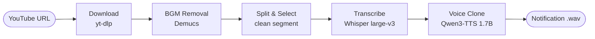

# Karina Voice Notification Generator

**AI Voice Cloning Tool** — Create custom notification sounds for Claude Code using any voice from YouTube videos. Powered by Qwen3-TTS, Whisper, and Demucs.

<p align="center">
  
  
  
  
  
  <a href="README.ko.md"></a>
</p>

<p align="center">
  
</p>

## 📖 What is this?

Claude Code plays a notification sound when it needs your attention — a permission
prompt, a finished task, and so on. This tool lets you **replace those sounds with a
cloned voice of your choice**, cloned from any YouTube clip.

Point it at a YouTube URL (an interview, a stream, a podcast), pick a clean few
seconds of speech, and it generates a full set of Korean/English notification lines
in that person's voice — ready to wire into Claude Code with one command. Everything
runs **locally** on your machine (Apple Silicon or an NVIDIA GPU); no audio ever
leaves your computer.

Prefer to just hear it first? Jump to the [🔊 Voice Samples](#-voice-samples) at the bottom.

## 📦 Requirements & Installation

| Platform | Requirements |
|----------|-------------|
| **macOS** | Apple Silicon (M1+), 32GB+ RAM, [pixi](https://pixi.sh) |
| **Linux** | NVIDIA GPU, CUDA 12.0+, [pixi](https://pixi.sh) |

```bash
git clone https://github.com/t1seo/karina-voice-notification.git
cd karina-voice-notification

pixi install
pixi run install-deps-mac    # macOS (Apple Silicon)
pixi run install-deps-linux  # Linux (NVIDIA GPU)
```

## 🔄 Workflow

The pipeline turns a raw YouTube link into clean voice notifications in six steps:



| Step | Technology | Notes |
|------|------------|-------|
| Download | yt-dlp | Extracts best-quality audio |
| BGM Removal | Demucs (Meta AI) | Optional — strips background music for a cleaner reference |
| Split & Select | pydub | Cut into segments; pick 5–15s of clean speech |
| Transcription | Whisper large-v3 | mlx-whisper (Mac) / faster-whisper (Linux) |
| Voice Cloning | **Chatterbox** (default) / Qwen3-TTS / IndexTTS-2 / CosyVoice | Swappable engine — see below |

### 🧩 Voice engines (backends)

The cloning step is pluggable — pick the model with `--backend`:

| Backend | License | Notes |
|---------|---------|-------|
| **`chatterbox`** (default) | MIT | Most natural in 2026 blind tests; zero-shot, no transcript needed |
| `qwen3` | — | The original Qwen3-TTS 1.7B |
| `indextts2` | open | SOTA zero-shot, strong Korean; MLX build for Apple Silicon *(optional install)* |
| `cosyvoice` | Apache-2.0 | Excellent cross-lingual cloning *(optional install)* |

```bash
pixi run install-chatterbox                      # install the default engine
pixi run quickstart "<URL>" --backend chatterbox # or --backend qwen3, ...
```

> `chatterbox` and `qwen3` coexist in one env: `install-chatterbox` pins
> `transformers` to 4.57.3 (Qwen3's requirement), and the Qwen3 backend uses
> eager attention so it runs on Chatterbox's torch 2.6. `indextts2` / `cosyvoice`
> are optional installs from their own repos.

Works with both **Claude Code** and **Codex** — same skills, same sounds.

### 1. Generate the sounds

**Conversationally (recommended)** — in Claude Code or Codex, run the skill and it
walks you through it: paste a YouTube link, choose what each alert should say, done.

```
/generate-voice
```

**Or via the interactive CLI:**

```bash
pixi run pipeline          # menu-driven: URL → segment → generate
# or one-shot, non-interactive:
pixi run quickstart "https://youtu.be/VIDEO_ID" --line "idle_prompt:다 됐어요!"
```

Either way the notification set lands in `output/notifications/`.

### 2. Install into Claude Code / Codex

Run the setup skill in either tool:

```
/setup-notifications
```

Or run the installer directly:

```bash
pixi run install-notifications          # both tools (auto-detects)
python scripts/install_notifications.py --tool codex   # just Codex
python scripts/install_notifications.py --dry-run      # preview changes
```

It copies the sounds and wires up the events — **Claude Code**: `Stop` +
`Notification` hooks in `~/.claude/settings.json`; **Codex**: a `notify` program
in `~/.codex/config.toml` (fires on turn completion) plus the skills into
`~/.codex/skills/`. Every edited file is backed up, and it's safe to re-run.
Restart the tool afterward to load the hooks.

### 💡 Tips for best results

**Good voice sources**
- Interview clips, solo speaking, podcasts
- Enable **BGM Removal** for music videos

**Avoid**
- Noisy environments or multiple speakers
- Clips shorter than 5 seconds

### 🎨 Customization

Edit `notification_lines.json` to change the phrases:

```json
{"text": "Your custom phrase here", "filename": "permission_prompt_1.wav"}
```

### 🛠️ Troubleshooting

| Problem | Solution |
|---------|----------|
| Poor voice quality | Use a cleaner source, enable BGM Removal |
| Hook not playing | Check `~/.claude/sounds/` exists, verify permissions |
| Missing dependencies | Run `pixi run install-deps-mac` or `install-deps-linux` |
| YouTube download fails (HTTP 403) | Update yt-dlp: `pixi run pip install -U yt-dlp` |

## 🔊 Voice Samples

The same three Korean notification lines, cloned in Karina's voice ([interview source](https://www.youtube.com/watch?v=r96zEiIHVf4)) by **each engine** — compare how they sound. Press ▶ to play:

### 1. "작업을 완료했습니다." — *Task complete*

**Chatterbox** (default)

https://github.com/user-attachments/assets/f6e9a81f-5ba1-4373-a72a-2f2fb9870acf

**Qwen3-TTS**

https://github.com/user-attachments/assets/2440c136-482a-4281-919c-b06f43ae44a1

### 2. "실행 허가가 필요합니다." — *Permission required*

**Chatterbox** (default)

https://github.com/user-attachments/assets/e51b2a3a-3ee0-4a54-a643-14449e7c359b

**Qwen3-TTS**

https://github.com/user-attachments/assets/4414a9c8-8430-459f-88c7-e88460971a8e

### 3. "인증에 성공했습니다." — *Authentication succeeded*

**Chatterbox** (default)

https://github.com/user-attachments/assets/81f2c41d-0be4-4e26-80cc-71a06796d663

**Qwen3-TTS**

https://github.com/user-attachments/assets/5d1de7c1-bf1d-45ed-8b78-0525ecb2ebc1

> Players are waveform videos (labelled with the model) so they play inline on GitHub. Source `.wav` files are in [`assets/samples/`](assets/samples); regenerate any engine with `pixi run samples --backend <model>`.

## License

MIT License
