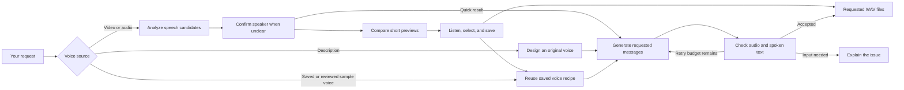

# Voice of Karina

**Tell Codex or Claude what you want to hear.** Use a voice from YouTube, describe an original voice, or reuse one you have saved. Get spoken WAV files and, if requested, a custom completion sound.

[한국어](README.ko.md) · [Model comparison](docs/model-comparison.md)

<p align="center">
  
</p>

## Just ask

**Reuse the reviewed Karina sample voice**

> Use the Karina voice from the README's reviewed “Attention needed” sample to say “다음 작업도 준비됐어요.” Save it so I can use the same voice again.

The exact reference and generation recipe used for that sample are packaged with
the project. You do not need to supply the video again.

**Use a voice from a video**

> Use Karina's voice from this video to say “작업이 끝났어요. 확인해 주세요.”
> https://www.youtube.com/watch?v=r96zEiIHVf4

**Prepare another person's voice**

> Compare clear solo speech from the videos I attached, then make “확인이 필요해요. 잠깐 봐 주세요.” Let me choose a preview and save the voice as “My guide.”

Attach one or more YouTube links for the person you want. The same preparation
and review flow works with other speakers; their output quality still needs review.

**Create a voice without a video**

> Create a warm, calm Korean female voice that says “잠시 쉬어 가셔도 괜찮아요.” Save it as “Calm guide.”

**Keep using the same voice**

> Use Calm guide again to say “다음 작업도 준비됐어요.”

You can start with “Help me make a voice.” The skill asks whether you want to reference a person or design a new voice, then asks only for missing details. For a new mimic voice, provide one or more YouTube links. For design, describe the voice. If several people speak, confirm the right person, then choose between short generated previews before saving. You can also ask for a quick result from one reference. Links, messages, and choices already given are not requested again.

## Install once

Local speech generation currently supports **macOS 14 or later on Apple Silicon** with Python 3.12, [uv](https://docs.astral.sh/uv/getting-started/installation/), and FFmpeg. Models download on first use. YouTube and model downloads need an internet connection; reference analysis and synthesis run locally.

```bash
brew install uv ffmpeg
git clone https://github.com/t1seo/voice-of-karina.git
cd voice-of-karina
uv sync --extra local
```

Open this folder in **Codex or Claude Code** and make a request like the examples above. Both discover the same `voice-of-karina` skill. For explicit selection, use `$voice-of-karina` in Codex or `/voice-of-karina` in Claude Code.

To use it from other projects, ask your agent:

> Install this repository's voice-of-karina skill for my user in Codex and Claude Code. Link the existing skill folder, preserve any existing installation, and keep this repository as the local engine.

The canonical folder is `.agents/skills/voice-of-karina`. Personal links go in `~/.agents/skills/voice-of-karina` and `~/.claude/skills/voice-of-karina`. Keep the checkout in place. The skill resolves its real location and bootstraps dependencies through uv, even when used from another folder.

This implementation has no Linux/CUDA, Intel Mac, CPU-only, or API synthesis backend. Alternative local models and hosted APIs are compared in the [model notes](docs/model-comparison.md); they are not automatic fallbacks.

## What happens during a request



New reusable voices normally start with two references and four paired previews.
The comparison has a fixed budget, with at most 12 trials, and resumes unfinished
work without repeating completed trials. A choice must pass every preview text
before it is eligible for selection. You choose the sound you prefer; automated
checks do not decide whether it sounds natural or resembles the right person.
If a selected preview already says your requested message, it is returned directly.

For regular message generation, the engine keeps resumable jobs and per-message results. Its quality loop allows **two total attempts per message** by default, with a maximum of three. Accepted messages are preserved when another needs a retry. Resume continues the saved job without resetting its attempt budget.

You can give feedback after an automatic pass, such as “There is noise at the beginning; try again.” The skill records why that artifact was rejected and uses the same job's remaining attempts. Recovery cannot select the rejected file again, and other accepted messages stay intact.

Saved voices keep the exact reference recording, transcript, and generation recipe.
Compared voices also retain the selected preview evidence and review reason.
Follow-up messages restore those conditions and skip source acquisition and
candidate comparison. A new message still receives its own output checks; saving
a voice does not approve all future speech. Older reference-only profiles remain
usable without being treated as reviewed recipes.

Jobs and voices live in `.voice-of-karina/` inside the checkout by default, even when the skill is invoked from another folder. `VOICE_OF_KARINA_HOME` selects a different persistent store. Keep the same store when resuming or reusing voices.

## Naturalness and noisy videos

The default is to choose a clear original utterance. There is **no blanket music separation, denoising, EQ, or compression**. Those operations can alter the voice you want to preserve.

Analysis measures speech coverage, level, clipping, and spectral characteristics, then exposes candidate clips and warnings. These are heuristics, not reliable music detection or automatic speaker identification. Multiple links provide more candidates; recordings are not automatically mixed together.

Good references contain one person speaking a short, complete phrase clearly. For heavy music, overlapping speakers, or reverberation, provide another interval or a cleaner video. A timestamp helps select the intended person.

When reliable transcription contains several utterances, analysis can propose shorter clips bounded by measured pauses. Each new crop is transcribed again before recommendation. The list shows up to four candidates, including at least one original fallback. Reference PCM keeps its native sample rate. Existing saved voices keep their original references; select a new candidate to save an improved reference separately.

Mimicry and saved voices now use **Qwen3-TTS 1.7B Base (4-bit)**, prioritizing quality with slower generation than the previous 0.6B model; see the [measured tradeoff](docs/model-comparison.md). Output checks combine audible signal quality, stricter text matching, the requested ending, and an acoustic check for abrupt Korean vowel endings. Suspect results are regenerated within the attempt budget. Generation that reaches its token limit is rejected. Missing or uncertain transcription remains unverified. These checks do not guarantee pronunciation, naturalness, or speaker similarity; listen before choosing a result. Saved-voice speed and emotion controls are not exposed.

The [quality improvement notes (Korean)](docs/quality-improvement-notes.ko.md) explain the ending fix and reference experiments. The [reusable voice research](docs/reusable-voice-research.md) covers reference curation, evaluation limits, and local alternatives; the [implementation validation record](docs/reusable-voice-validation.ko.md) records the actual reuse and comparison checks.

## Optional completion notifications

> Use the finished message as my completion sound in Codex and Claude Code.

The skill installs only when asked. It uses **Claude's `Stop` hook** and **Codex's `agent-turn-complete` notification**. Permission, authentication, and other event types are not wired in this version.

Comparison previews can be played and downloaded. To apply one as a notification,
the skill uses your selected voice to create and check a regular message first;
comparison trial files are not installed directly.

The installer backs up changed settings, retains unrelated Claude hooks, and forwards events to an unrelated existing Codex notification program. Known hooks from this project's old player are replaced on explicit installation to avoid duplicate playback. Reinstalling the same sound is idempotent. Each tool gets its own player and WAV under its configuration home, so playback does not load an AI model or require this project's environment. Restart the selected agent to load changed settings.

## Listen to Karina samples

Fresh Korean samples generated by this engine from the [Karina interview reference](https://www.youtube.com/watch?v=r96zEiIHVf4). These are synthetic demonstrations, not recordings of Karina saying these lines. Press play on each video.

**Task complete** · 작업이 끝났어요. 확인해 주세요.

https://github.com/user-attachments/assets/93c3f76f-097a-4e78-9cf8-0260fc86378f

**Attention needed** · 확인이 필요해요. 잠깐 봐 주세요.

Selected from a controlled local experiment and revalidated; [reference and quality notes](docs/quality-improvement-notes.ko.md#7-공개-샘플의-선택과-한계).

https://github.com/user-attachments/assets/1c1be57f-a4df-4fc5-8141-d00014bcc526

**Ready for the next task** · 다음 작업도 준비됐어요.

https://github.com/user-attachments/assets/d228e9b7-9f96-40b7-9f25-9fcb03751b47

**Take a break** · 오늘도 수고 많으셨어요. 잠깐 쉬었다가 다시 시작해 볼까요?

https://github.com/user-attachments/assets/db7d7fc2-3ee0-4682-a955-bea2725e0767

Download the WAVs: [complete](assets/samples/karina-done.wav), [attention](assets/samples/karina-attention.wav), [ready](assets/samples/karina-ready.wav), [take a break](assets/samples/karina-break.wav). An [original designed voice](assets/samples/original-rest.wav) says “잠시 쉬어 가셔도 괜찮아요.” Open [the listening gallery](docs/samples.html) locally to play the WAV files. Generation inputs and quality results are recorded in [sample provenance](assets/samples/provenance.json).

## Development

The user interface is the conversation skill. Its private JSON transport is documented in the [engine reference](.agents/skills/voice-of-karina/references/engine.md).

```bash
uv run pytest
uv run ruff check .
uv run basedpyright
```

## Support

[](https://www.buymeacoffee.com/taewonseo)

## License

MIT. Generated audio is synthetic; it is not a recording or endorsement by the person used as a voice reference.
